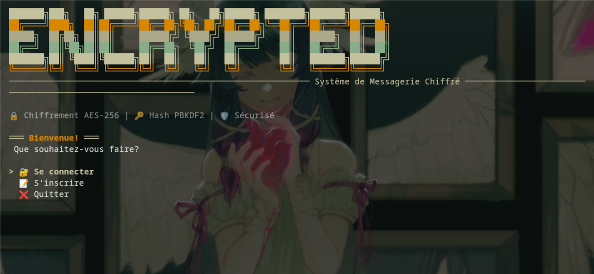

# 🔐 Encrypted Messaging System

A secure terminal-based messaging application built with C# (.NET 9), featuring AES-256 encryption, PBKDF2 password hashing, and a beautiful Gruvbox-themed TUI.


## ✨ Features

- 🔒 **AES-256 Encryption** - All messages encrypted before storage
- 🔑 **PBKDF2 Password Hashing** - Secure user authentication (100k iterations)
- 📨 **Real-time Messaging** - Send, receive, edit, and delete messages
- 👑 **Admin Panel** - User management with protected accounts
- 🔔 **Notification System** - Badge indicators for unread messages
- 🔄 **Manual Refresh** - Check for new messages on-demand
- 🎨 **Gruvbox Theme** - Beautiful terminal interface with Spectre.Console
- 💾 **SQLite Database** - Lightweight with ADO.NET
- 🖥️ **Cross-platform** - Works on Windows, Linux, and macOS

## 🚀 Quick Start

### Prerequisites
- [.NET 9 SDK](https://dotnet.microsoft.com/download/dotnet/9.0)

### Installation

```bash
# Clone the repository
git clone https://github.com/yourusername/encrypted-messaging.git
cd encrypted-messaging

# Restore dependencies
dotnet restore

# Build and run
dotnet run
```

## 🎮 Usage

### Regular User
1. **Register** an account or **Login**
2. Send encrypted messages to other users
3. View received messages (auto-marked as read)
4. Edit/delete your sent messages
5. Use **🔄 Rafraîchir** to check for new messages

### Admin Access
- **Username**: `admin`
- **Password**: `admin`

Admin capabilities:
- Create users with the `ADMIN_` prefix
- Modify/delete only admin-created accounts
- View system statistics
- Self-registered users are protected

## 🏗️ Architecture

```
EncryptedMessaging/
├── Models/          # User and Message entities
├── Security/        # AES encryption & password hashing
├── Data/            # SQLite repositories (ADO.NET)
├── Services/        # Business logic
└── UI/              # Spectre.Console interface
```

### Database Schema

**Users Table**
```sql
- Id (INTEGER PRIMARY KEY)
- Username (TEXT UNIQUE)
- PasswordHash (TEXT)
- CreatedAt (TEXT)
```

**Messages Table**
```sql
- Id (INTEGER PRIMARY KEY)
- SenderId (INTEGER FK)
- ReceiverId (INTEGER FK)
- EncryptedContent (TEXT)
- SentAt (TEXT)
- IsRead (INTEGER)
```

## 🔐 Security

- **Encryption**: AES-256-CBC with PKCS7 padding
- **Password Hashing**: PBKDF2-HMAC-SHA256 (100k iterations, 128-bit salt)
- **Message Storage**: All messages encrypted at rest
- **Admin Protection**: User-created accounts cannot be modified by admin

> ⚠️ **Note**: In production, encryption keys should be stored securely (Azure Key Vault, environment variables, etc.)

## 📦 Dependencies

```xml
<PackageReference Include="Spectre.Console" Version="0.49.1" />
<PackageReference Include="System.Data.SQLite.Core" Version="1.0.119" />
<PackageReference Include="Microsoft.AspNetCore.Cryptography.KeyDerivation" Version="9.0.0" />
```

## 🎨 Screenshots




## 🤝 Contributing

Contributions are welcome! Feel free to:
- Report bugs
- Suggest features
- Submit pull requests

## 📄 License

This project is licensed under the MIT License.

## 🙏 Acknowledgments

- Built with [Spectre.Console](https://spectreconsole.net/)
- Inspired by secure messaging principles
- Gruvbox color scheme

---

